# Week 1 Assignments – WeIntern Pvt Ltd

**Intern:** Sunaina Dhali  
**GitHub:** [@sunainadhali](https://github.com/sunainadhali)  
**Organization:** WeIntern Pvt Ltd  
**Program:** Web Development Internship – Week 1  

---

## Objective

Complete three structured frontend tasks to strengthen practical skills in semantic HTML5, modern CSS3, responsive design, layout systems (Flexbox & Grid), and professional project delivery.

---

## Live Demo

🔗 [Main Navigation Page](https://sunainadhali.github.io/week-1-assignment/)

| Task | Live Link |
|------|-----------|
| Task 1 – Portfolio Website | [View Live](https://sunainadhali.github.io/week-1-assignment/Portfolio%20website/) |
| Task 2 – Business Landing Page | [View Live](https://sunainadhali.github.io/week-1-assignment/Business%20landing%20page/) |
| Task 3 – CSS Challenge | [View Live](https://sunainadhali.github.io/week-1-assignment/css-challenge/) |

---

## Tech Stack

- HTML5
- CSS3 (Flexbox, Grid, Animations)
- JavaScript (light interactivity)
- Git & GitHub Pages

---

## Repository Structure

```
week-1-assignment/
├── index.html                  ← Navigation hub
├── Portfolio website/
│   ├── index.html
│   ├── about.html
│   ├── projects.html
│   ├── contact.html
│   ├── css/
│   │   └── style.css
│   ├── js/
│   │   └── script.js
│   └── assets/
│       ├── images/
│       └── icons/
├── Business landing page/
│   ├── index.html
│   ├── css/
│   │   └── style.css
│   └── assets/
├── css-challenge/
│   ├── index.html
│   └── css/
│       └── style.css
├── screenshots/
└── README.md
```

---

## Tasks

---

### Task 1 – Professional Portfolio Website

**Objective:** Build a multi-page personal portfolio presenting the intern as a capable frontend developer.

**Pages:**
- Home
- About
- Projects
- Contact

**Features Implemented:**
- Professional hero banner with name, title, and introduction
- About section with profile summary
- Skills / tech stack section
- Projects showcase (2–3 sample projects)
- Contact section with email, social links, and a contact form
- Footer with copyright, nav links, and GitHub/LinkedIn profile
- Fully responsive layout (desktop, tablet, mobile)
- Semantic HTML5 structure (`header`, `nav`, `main`, `section`, `footer`)

**Screenshots:**

| View | Screenshot |
|------|------------|
| Home – Desktop | 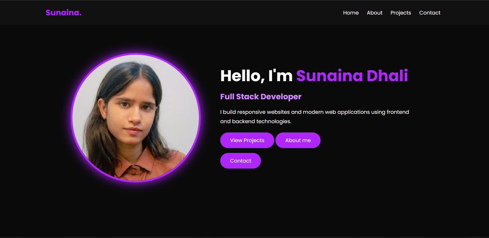 |
| Home – Mobile | 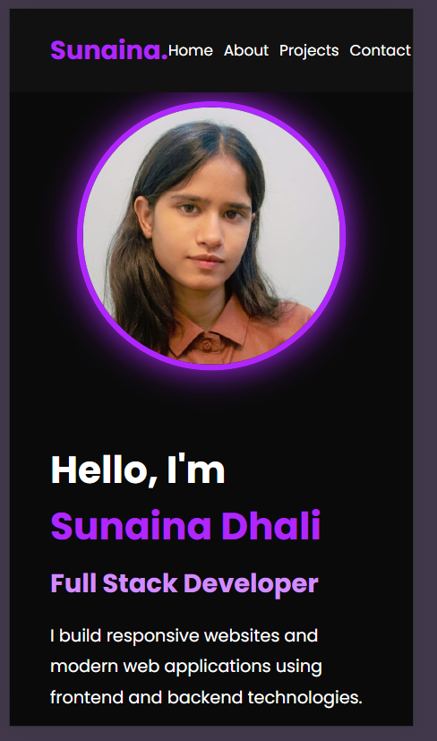 |
| Projects Section | 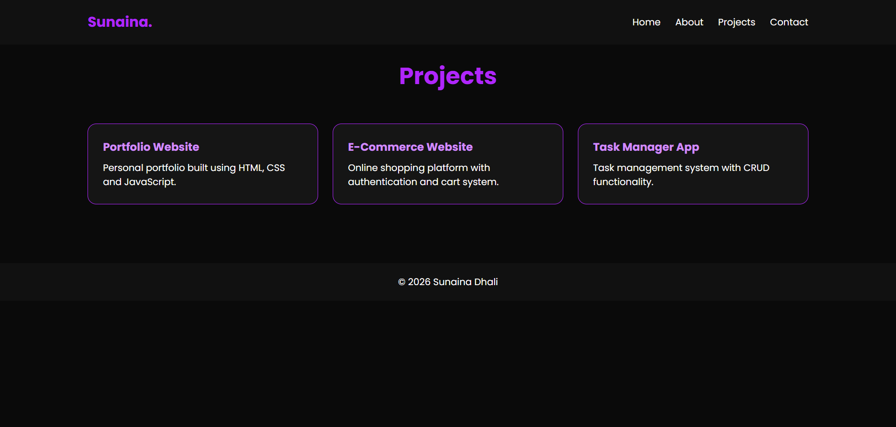 |
| Contact Page | 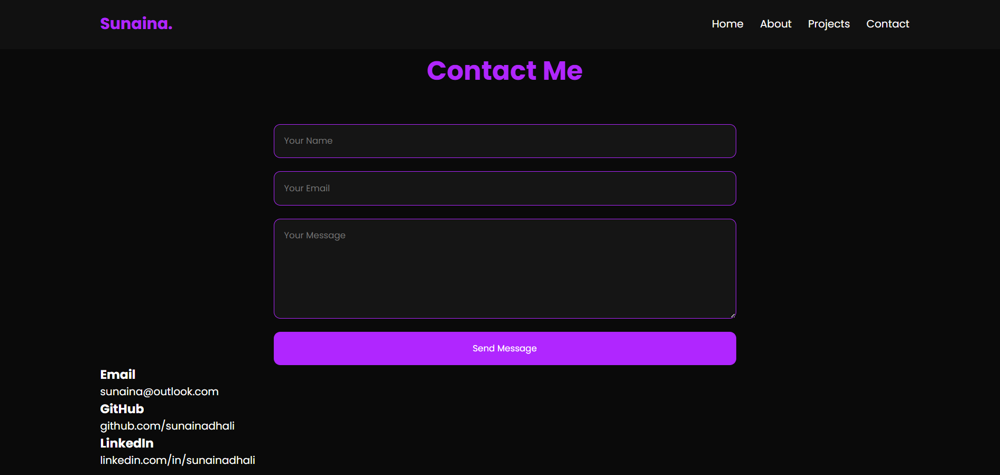 |
🔗 [View Live](https://sunainadhali.github.io/week-1-assignment/Portfolio%20website/)

---

### Task 2 – Responsive Business Landing Page

**Objective:** Build a modern, brand-consistent landing page for a fictional or real business that guides visitors through key sections.

**Business Type:** <!-- e.g., Digital Agency / Restaurant / SaaS Startup -->

**Features Implemented:**
- Sticky navigation bar with brand name, section links, and CTA button
- Hero section with headline, subtext, and CTA buttons
- Services section (3–6 service cards with icons and descriptions)
- Contact form (Name, Email, Phone, Message, Submit) with HTML validation
- Fully responsive layout (mobile-first, breakpoints at 768px)
- Consistent branding, typography scale, and whitespace usage

| View | Screenshot |
|------|------------|
| Full Page – Desktop | 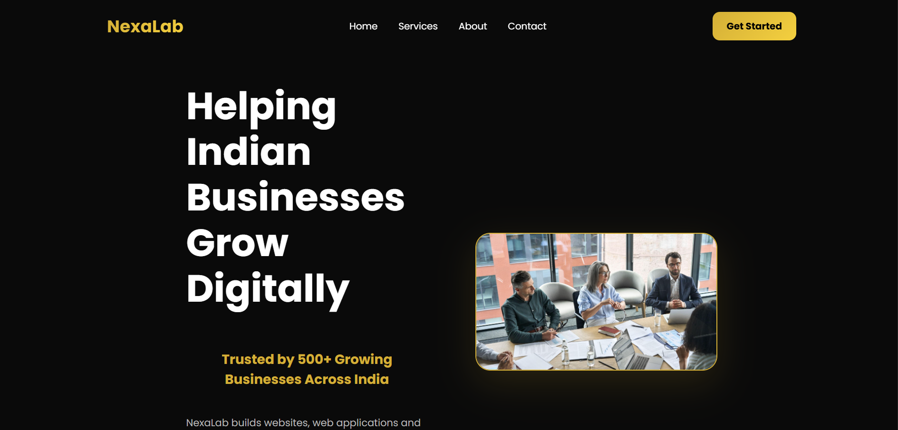 |
| Hero – Mobile | 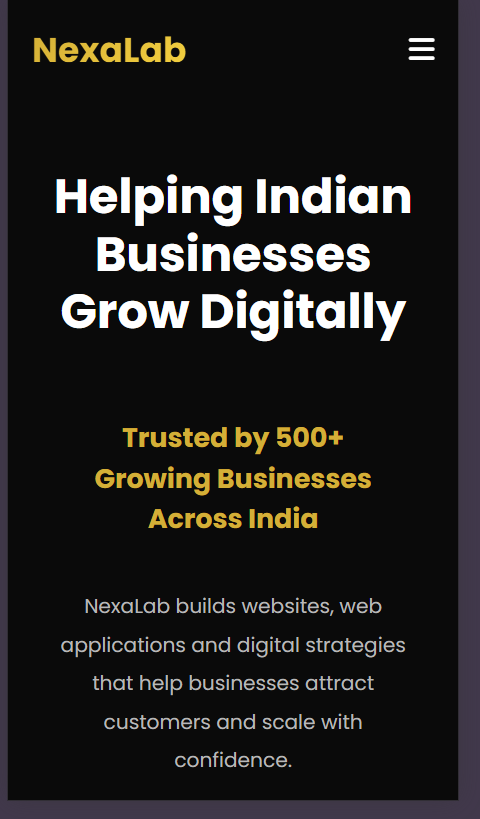 |
| Services Section | 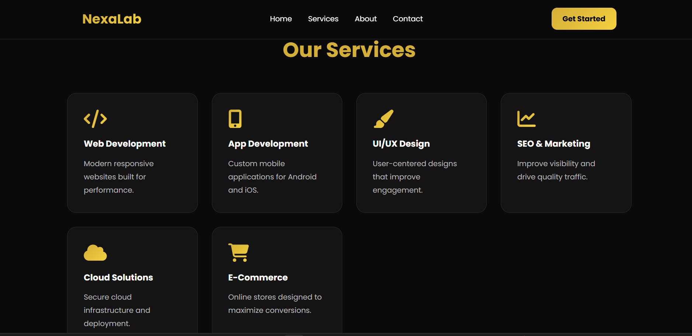 |
| Contact Form | 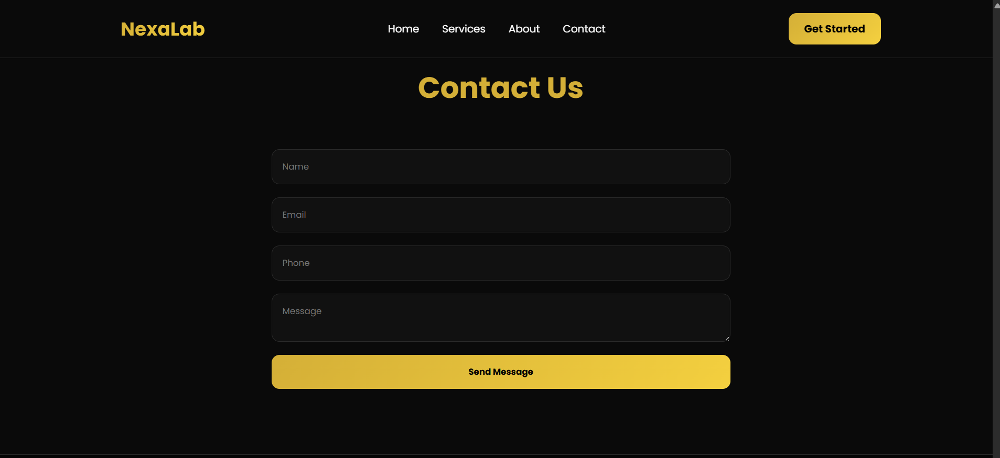 |

🔗 [View Live](https://sunainadhali.github.io/week-1-assignment/Business%20landing%20page/)

---

### Task 3 – CSS Challenge

**Objective:** Improve practical CSS layout and animation skills through three focused mini-exercises.

**Exercises:**

#### Flexbox Layout
- Responsive testimonial/feature-card row
- 3 cards in a row on desktop → stacked vertically on mobile
- Uses `justify-content`, `align-items`, `gap`, and flexible widths
- Hover effects for interaction feedback

#### Grid Layout
- Gallery/dashboard-style layout with 6+ grid items
- Uses `repeat()` and responsive sizing
- Responsive rearrangement at smaller breakpoints

#### Animation Component
- <!-- e.g., Button hover animation / Loading spinner / Fade-in reveal / Card lift effect -->
- Uses `transition`, `transform`, and/or `@keyframes`
- Smooth, subtle, and UI-supportive

**Screenshots:**
| View | Screenshot |
|------|------------|
| Flexbox – Desktop | 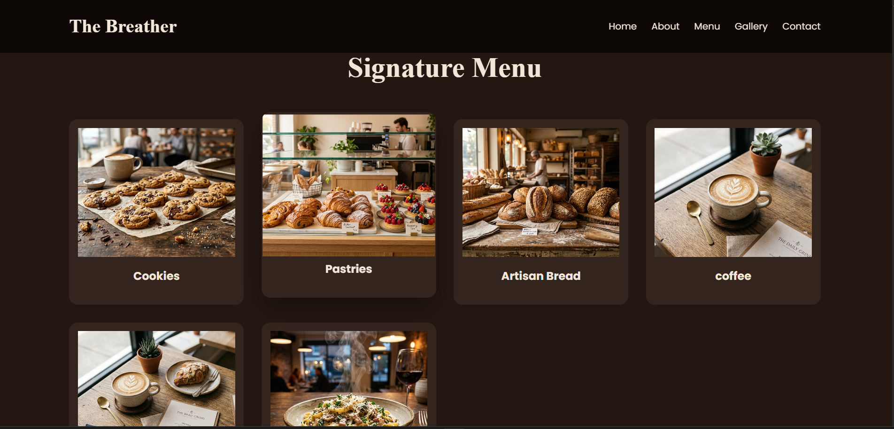 |
| Flexbox – Mobile | 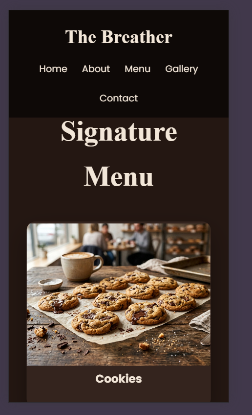 |
| Grid Layout | 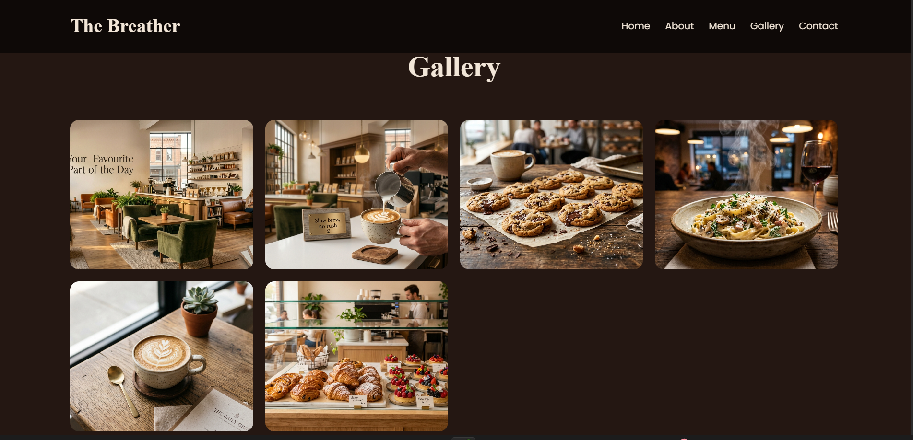 |
| Animation Demo | 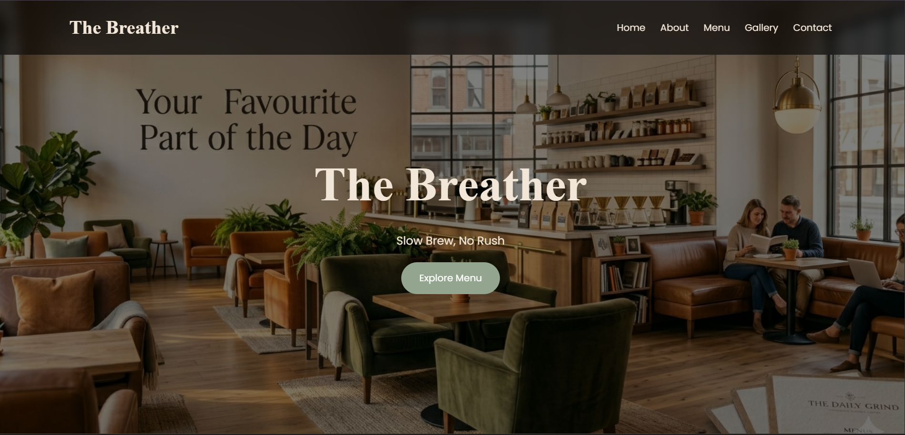 |

🔗 [View Live](https://sunainadhali.github.io/week-1-assignment/css-challenge/)

---

## Setup & Run Instructions

1. Clone the repository:
   ```bash
   git clone https://github.com/sunainadhali/week-1-assignment.git
   ```
2. Open `index.html` in any modern browser.
3. Click a task link to navigate to that project.

> No build tools or dependencies required — pure HTML, CSS, and JavaScript.

---


---

## Author

**Name:** Sunaina Dhali  
**GitHub:** [@sunainadhali](https://github.com/sunainadhali)  

---

*Submitted as part of the WeIntern Pvt Ltd Web Development Internship – Week 1.*
